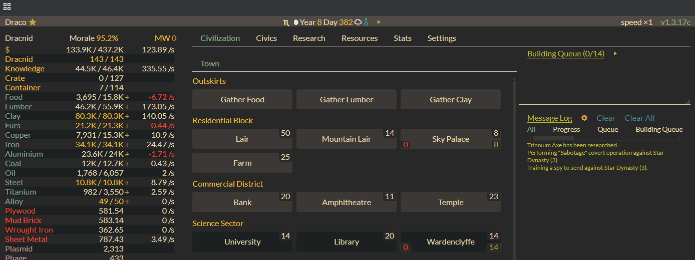

# ⚡ Evolve Game Speed Multiplier

[Install](https://github.com/julesferreira/evolve-game-speed/raw/refs/heads/main/script.user.js) to pull at _the magic thread_ (warning: may ruin your fun!)

## What it does

This userscript adds a speed multiplier button to [Evolve](https://pmotschmann.github.io/Evolve/), letting you fast-forward through the waiting game. Click the button in the top-right corner to accelerate time!

## Requirements

- A userscript manager like Tampermonkey, Greasemonkey, or Violentmonkey

## Usage

1. Install a userscript manager if you haven't already
2. Click the [Install](https://github.com/julesferreira/evolve-game-speed/raw/refs/heads/main/script.user.js) link above
3. Navigate to [Evolve](https://pmotschmann.github.io/Evolve/)
4. Look for the speed multiplier in the top-right corner
5. Click to accelerate time! Any number above 1x is allowed

## Tips & Troubleshooting

- While any speed is technically possible, things get wonky beyond 10x
- If the game acts up, try:
  1. Pausing and resuming
  2. If that doesn't work, refresh the page
  3. If all else fails, try a lower speed multiplier
